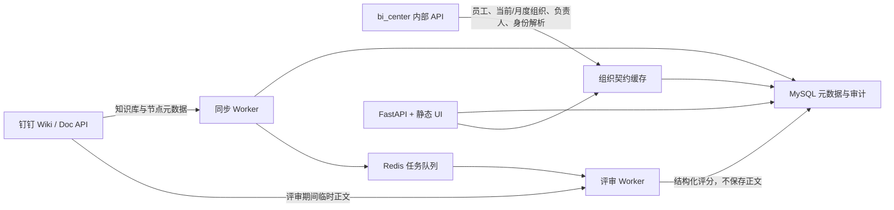

# 钉钉知识库治理服务一期规划

**状态：** 需求分析完成，等待 POC 与实施拆分

**目标运行方式：** Docker Compose

**建议应用端口：** `127.0.0.1:39057`（实施前需登记到总工作区端口表并确认服务器未占用）

## 1. 决策摘要

用户提出的六项能力整体可行，但必须明确三条边界：

1. **组织归属必须消费 `bi_center` 的最终契约**，不能在本服务再次解释钉钉部门树。
2. **文档正文可临时获取并评分，但不长期保存**；正文权限和 `wiki nodeId -> dentryUuid` 的映射要先做最小权限 POC。
3. **钉钉可提供知识库/节点创建人和时间，但审核员、AI 评分、重评历史、知识库归属部门属于本服务数据**。知识库管理员能否完整同步需验证权限范围接口；一期允许由系统管理员在本服务内维护。

## 2. 一期业务范围

一期建设“入库后治理”，不做入库前阻断：

- 同步知识库、目录和文档节点；
- 保存当前态、同步批次和历史增量；
- 对新增或更新文档创建评审任务；
- 临时读取正文，完成 AI 评分后立即释放正文；
- 保存不可变评审实例与人工审核结论；
- 按知识库、部门、业务组、员工和月份展示数量与质量；
- 管理知识库归属部门、管理员、审核员和评分策略；
- 对身份未匹配、正文无权限、同步失败和评审失败提供诊断页。

一期不做：向量库、RAG、正文搜索、正文长期缓存、自动修改文档、自动删除文档、自动调整钉钉权限。

## 3. 推荐技术架构



### Docker Compose 服务

| 服务 | 作用 | 持久化 |
| --- | --- | --- |
| `knowledge-governance-api` | API、登录鉴权、静态 UI、健康检查 | 不保存正文；业务元数据写 MySQL |
| `knowledge-governance-worker` | 定时同步、正文获取、AI 评审、重评任务 | 文档仅写容器 `tmpfs`，任务结束清理 |
| `knowledge-governance-redis` | 任务队列、短期缓存、分布式锁 | 可持久化队列元数据，不含正文 |
| `knowledge-governance-db` | 开发环境可选 MySQL profile | 生产默认接既有/受管 MySQL；只存治理数据 |

API 与 worker 使用同一镜像、不同启动命令。Compose 应包含健康检查、`restart: unless-stopped`、只绑定本机端口、`tmpfs`、资源限制和明确时区。生产数据库、Redis、模型与钉钉密钥只由 `.env` 或秘密管理系统注入。

## 4. 正文临时处理流程

1. 同步 Worker 发现新 `nodeId`，或相同节点的 `modifiedTime`/内容指纹变化。
2. 创建幂等评审任务，唯一键建议为：`node_id + source_modified_at + rubric_version + model_config_version`。
3. 文档适配器通过节点 URL/ID 查询文档条目，取得 `dentryUuid`。
4. 调用钉钉文档内容任务接口；异步轮询任务状态后取得内容结果。
5. 正文仅进入进程内存；确需文件转换时写入 `tmpfs`，设置大小、格式、超时和并发上限。
6. 规则引擎先做确定性校验，AI 再输出结构化维度分、问题和摘要。
7. 数据库保存内容 SHA-256、评分结果、模型/规则版本和任务状态，不保存正文及默认不保存原文摘录。
8. `finally` 清理内存引用和 `tmpfs` 临时文件；日志只记录实例 ID、状态、耗时和错误类别。

若正文接口没有权限、文件类型不支持或映射失败，记录 `content_unavailable`，只允许生成 `review_scope=metadata_only` 的元数据合规分。

## 5. `bi_center` 组织映射方案

### 5.1 权威边界

- 员工正式主键：`employeeKey=UnionID`。
- 当前页面筛选和角色配置：消费 `GET /api/internal/v1/employee-directory/current`。
- 历史/月度统计：消费 `GET /api/internal/v1/employee-directory/monthly?month=YYYY-MM`。
- 部门/业务组负责人：消费 `GET /api/internal/v1/employee-directory/leaders/current`。
- 上传人/创建人解析：批量调用 `POST /api/internal/v1/employee-identity/resolve-batch`。
- 未匹配与冲突：批量回传 `POST /api/internal/v1/employee-identity/diagnostics/batch`。
- 缓存刷新依据：`contractVersion`、`directoryVersion`、`leaderVersion`、`policyVersion` 和 `monthlyDirectoryVersions`。

本服务不能直连 `bi_center_sync_db`，也不能复制 7 个研发部门、成都分部过滤、`DeptName/BizGroupName` 反转或姓名推断规则。

### 5.2 员工、部门、业务组的落库方式

| 对象 | 主键/来源 | 本服务保存内容 |
| --- | --- | --- |
| 员工 | `employeeKey` / UnionID | employeeKey、展示名、当前组织缓存版本；原始钉钉 `creatorId` 另存作源身份证据 |
| 部门 | `primaryDeptId + departmentName` | 知识库归属部门的选择结果和名称快照 |
| 业务组 | `bizGroupName`（现有契约未暴露稳定业务组 ID） | 名称快照；不自行推断层级 |
| 月度归属 | 月度目录接口 | 文档入库月对应的部门/业务组快照及解析版本 |

现有目录契约足以完成员工和月度归属；但它不是完整组织树接口，无法保证列出“当前没有员工的业务组”。一期可从正式员工目录生成可选部门/业务组；若必须展示完整组织树，应单独扩展 `bi_center` 只读契约，不能在本服务复制组织算法。

### 5.3 上传人归属口径

- `creatorId` 作为钉钉源身份，不直接当正式员工主键。
- 按文档 `createTime` 所在月份调用 `resolve-batch`，得到正式 `employeeKey` 和该月部门/业务组。
- 只有 `matched && includeInOfficialStats=true` 的记录进入正式员工、部门、业务组统计。
- `unassigned`、`conflict`、`inactive`、`snapshot_missing` 进入诊断，不伪造归属。

## 6. 角色与权限

知识库层面需要区分：

| 角色 | 来源 | 能力 |
| --- | --- | --- |
| 创建人 | 钉钉 `workspace.creatorId`，再经 bi_center 解析 | 展示与审计，不自动获得本服务管理权限 |
| 知识库管理员 | 一期由本服务配置；若 POC 能完整读取钉钉权限范围，可标记同步来源 | 维护归属部门、审核员、评分规则，查看诊断 |
| 审核员 | 本服务配置，成员来自 bi_center 正式员工目录 | 人工通过/退回、填写意见、发起重评 |
| 系统管理员 | 本服务鉴权配置 | 管理全部知识库、同步、模型、权限和系统配置 |
| 查看者 | 按部门或知识库授权 | 查看被授权范围的统计和评审结果 |

知识库归属部门、管理员和审核员都必须保存变更审计：操作者、变更前后、原因、时间。AI 分数不是人工审核结论。

## 7. 评分与重评模型

### 7.1 评分字段

每次评审生成一条不可变实例：

- `review_instance_id`：服务生成的 ULID/UUID，页面显示的“评审实例 ID”；
- `source_node_id`、`dentry_uuid`：钉钉源实例标识；
- `workspace_id`、知识库名称、文档名称；
- 上传人源 ID、正式 `employee_key`、员工姓名、入库月部门/业务组；
- `ai_score`、`review_scope`、`confidence`、维度分、问题清单；
- `rubric_version`、`model_provider`、`model_name`、`model_config_version`；
- `content_fingerprint`、`source_modified_at`、开始/完成时间、耗时；
- AI 状态、人工审核状态、人工意见、审核员；
- `trigger_type`：首次入库、内容更新、规则升级、模型升级、人工重评。

“重评次数”不作为可写字段：`同一 node_id 的有效评审实例数 - 1`。文档当前表可以缓存该派生值用于列表性能，但历史实例是权威来源。

### 7.2 建议评分维度（0–100）

| 维度 | 分值 | 说明 |
| --- | ---: | --- |
| 完整性 | 25 | 目标、适用范围、责任人、步骤、输入输出是否完整 |
| 结构与可读性 | 15 | 标题层级、段落、表格、术语和导航是否清晰 |
| 准确性与证据 | 20 | 事实、数据、引用和结论是否有依据；AI 只能给风险判断，关键事实需人工复核 |
| 可执行性 | 15 | 是否能指导实际操作，异常和边界是否明确 |
| 时效与元数据 | 10 | 更新时间、版本、所有者、文件名和目录是否合规 |
| 合规与风险 | 15 | 敏感信息、越权内容、冲突、重复和不当外发风险 |

建议阈值：`>=80` AI 建议通过，`60–79` 需要人工复核，`<60` 建议退回。阈值应配置化并版本化；最终状态由审核员确认。

## 8. 最小数据模型

| 表 | 关键字段 | 作用 |
| --- | --- | --- |
| `kg_workspaces` | workspace_id、name、creator_source_id、owner_department、同步状态 | 知识库当前态 |
| `kg_workspace_roles` | workspace_id、role_type、employee_key、source、有效期 | 管理员/审核员/查看者关系 |
| `kg_nodes_current` | node_id、workspace_id、parent_id、name、create/modify time、creator、content_fingerprint、is_deleted | 文档/目录当前态 |
| `kg_node_snapshots` | sync_run_id、node_id、路径/元数据哈希 | 增量与审计 |
| `kg_sync_runs` | 批次、状态、扫描数、增删改数、错误摘要 | 同步可观测性 |
| `kg_review_instances` | review_instance_id、node_id、score、scope、状态、版本、触发原因 | 不可变评审历史 |
| `kg_review_dimensions` | review_instance_id、dimension_key、score、reason | 维度分与解释 |
| `kg_review_decisions` | review_instance_id、reviewer、decision、comment、created_at | 人工审核审计 |
| `kg_employee_org_cache` | employee_key、目录/月度版本、部门、业务组、有效状态 | bi_center 最小缓存 |
| `kg_monthly_workspace_metrics` | month、workspace_id、部门、数量与质量指标 | 月度看板物化结果 |

数据库中不存在正文表、附件表或正文搜索索引。

## 9. 月度数量明细

每个知识库、每个月至少展示：

- 月初文件数；
- 当月新增数；
- 当月更新数；
- 当月移动/重命名数；
- 当月删除数；
- 月末文件数；
- 首次评审数、重评次数、已审核数；
- AI 建议通过数、待人工复核数、低分数、正文不可用数；
- 最新 AI 平均分、人工通过率；
- 按上传人、入库月部门、业务组和文件类型的明细。

月份使用 `source_created_at` 作为业务入库月，另保留 `discovered_at` 作为技术发现时间。知识库归属部门统计与上传人月度组织统计必须分开，避免把“库属于哪个部门”和“谁上传、当月属于哪个部门”混为一个字段。

## 10. UI 信息架构

### 10.1 页面

1. **治理总览**：知识库数、文件数、本月新增、待审核、平均分、低分告警；月度趋势和部门分布。
2. **知识库管理**：知识库、归属部门、创建人、管理员、审核员、文件总数、本月新增、平均分、同步状态。
3. **文档评审**：文档名称、最新 AI 分、人工状态、评审实例 ID、重评次数、上传人、部门、业务组、所属知识库、入库/更新时间。
4. **评审详情**：分数圆环、维度分、问题清单、评审历史时间线、人工意见、重评按钮和钉钉原文入口；不回显本地正文副本。
5. **月度明细**：知识库/部门/业务组/员工/月份多维筛选，数量与质量趋势、导出。
6. **配置与诊断**：归属与角色、评分规则、模型、同步批次、身份冲突、正文权限失败。

### 10.2 视觉规范

- 沿用 `bi_center` 的 72px 顶部栏、约 248px 左侧导航、`#f8fafc` 蓝灰背景、白色卡片、蓝色主操作。
- 沿用 `ai_code_review_web` 的分数语义：绿色 `>=80`、琥珀色 `60–79`、红色 `<60`；使用徽标、圆形分数和趋势指示。
- 桌面以宽表和筛选器为主，窄屏把操作收进抽屉，表格允许横向滚动；技术 ID 显示为次要信息并支持复制。
- 同步/权限/正文不可用必须有可读状态，不把钉钉原始枚举直接展示给用户。

## 11. API 草案

```http
GET  /api/health
GET  /api/v1/dashboard/overview?month=YYYY-MM
GET  /api/v1/workspaces
GET  /api/v1/workspaces/{workspace_id}
PATCH /api/v1/workspaces/{workspace_id}/governance
GET  /api/v1/workspaces/{workspace_id}/monthly-metrics
GET  /api/v1/documents
GET  /api/v1/documents/{node_id}
GET  /api/v1/documents/{node_id}/reviews
POST /api/v1/documents/{node_id}/reviews
POST /api/v1/reviews/{review_instance_id}/decision
GET  /api/v1/diagnostics
POST /api/internal/v1/sync-runs
```

所有写操作记录操作者与审计。重评接口只创建新任务，不修改旧评审实例。

## 12. 分期实施

### POC：先验证外部能力

- 知识库、根节点和递归分页；
- `nodeId`/URL 到 `dentryUuid` 的映射；
- 文档内容异步任务、格式、大小、权限和限流；
- 知识库创建人和节点创建人字段；
- 知识库权限范围是否能完整取得管理员；
- `bi_center` 当前目录、月度目录、负责人、身份解析和诊断契约；
- 服务器端口 `39057` 与 Compose 网络。

### 第一期：元数据治理

- Docker Compose 基础、鉴权、数据库 schema；
- 知识库/节点同步、快照、增量、月度数量；
- bi_center 组织映射和诊断；
- 知识库归属部门、管理员、审核员配置；
- 总览、知识库、文档列表和同步诊断 UI。

### 第二期：AI 评审

- 临时正文获取与格式适配；
- 评分规则、模型提供方、评审队列；
- 评审详情、重评历史、人工审核；
- 低分与权限失败告警。

### 第三期：业务闭环

- 与 `bi_center` AI 积分事实对接；
- 月度冻结、申诉/修订与通知；
- 如有必要，再评估统一入库门户和入库前门禁。

## 13. 开工前需要冻结的四个决策

1. 服务登录是独立钉钉免登，还是复用现有登录态/内部会话契约。
2. AI 模型使用哪套供应商和配置来源；是否允许正文发送到企业外部模型。
3. 知识库管理员以钉钉权限为准、本服务配置为准，还是双向展示并标识来源。
4. 一期是否只覆盖研发体系，还是覆盖 `bi_center` 的全公司正式员工和真实业务部门。

其中第 2 项属于数据安全决策；未确认前，只能做元数据同步和规则评分，不能把真实知识库正文发送给模型。
